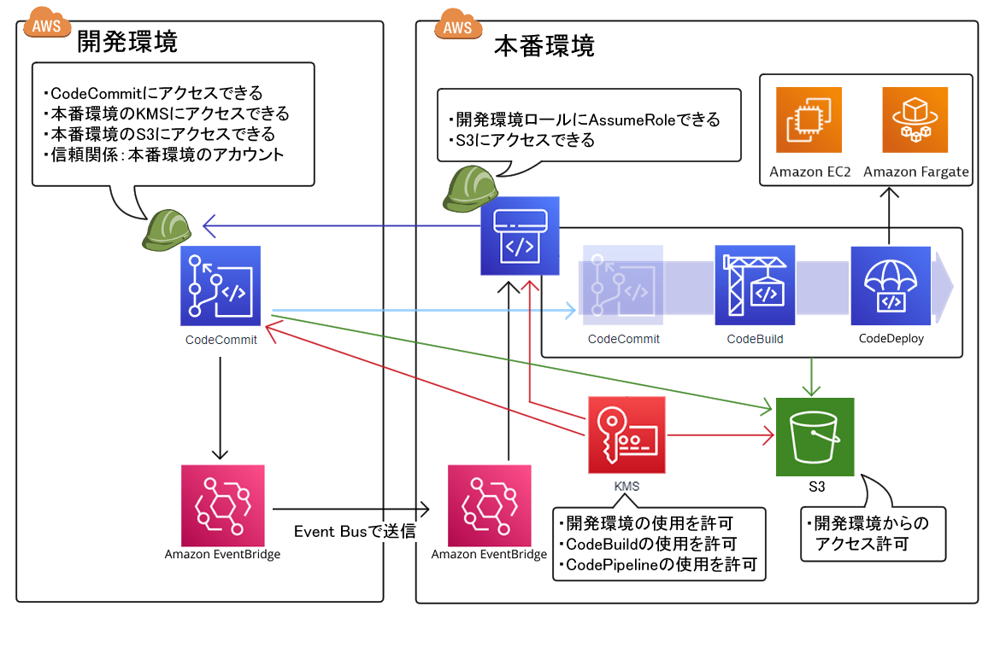

# クロスアカウントでのコードデプロイメモ

## 目次
- [概要](#概要)
- [KMSキーの作成](#kmsキーの作成)
- [アーティファクト用S3バケットの作成(本番環境)](#アーティファクト用s3バケットの作成本番環境)
- [CodeBuildの作成(本番環境)](#codebuildの作成本番環境)
- [CodePipelineの作成(本番環境)](#codepipelineの作成本番環境)
- [CodeCommitのロール変更(開発環境)](#codecommitのロール変更開発環境)
- [検出，パイプライン起動の自動化](#検出パイプライン起動の自動化)


## 概要
- CodeCommitを他アカウントと連携する場合，KMS暗号化が必須．
- それに伴い，アーティファクト用S3バケットにもKMS暗号化．
    - S3バケットはソースアーティファクトとしても利用するため，開発環境のCodeCommitから利用できるようにする必要がある
        - S3へのアクセス権限
        - KMSへのアクセス権限
- **Codeシリーズに関しては，作成する際に，マネジメントコンソールからの作成が不可のため，CLI利用**
- ブランチの変更検出にはEventBridgeを使用．
    - EventBridge Busを使用して，別アカウントのEventBridgeを起動し，パイプラインを動かす．
- 以下構成図


## 注意書き(メモ)
- 開発環境をterraformで構築し，開発環境で`terraform destroy`すると，本番環境のS3のバケットポリシーが勝手に変更される
- CodePipelineでCodeBuildがバッチビルドだと失敗します
    - 単一ビルドなら成功

## KMSキーの作成
- S3を暗号化するためにKMSキーを作成
    - STEP1:
        - キーのタイプ: `対象`
        - キーの使用法: `暗号化および復号化`
    - STEP3:
        - キー管理者に本番環境のアカウントの追加
    - STEP4:
        - キー使用法アクセス許可の定義で本番環境のアカウントの追加
        - 別のAWSアカウントを追加し，開発環境のIDを入力
- 各ロールにKMSキーの使用を許可
    - 作成したキーを選択し，キー管理者，キーユーザーを追加
        - 両方に本番環境のCodePipelineのロールを選択
            - **現時点ではできないので，CodePipelineのロールを作成してから！**


## アーティファクト用S3バケットの作成(本番環境)
- アーティファクトをやり取りするために，S3を使用する
- 作成したKMSを使用し，暗号化
- 開発アカウントから触れる必要があるため，バケットポリシーを記述する必要あり
    ```JSON
    {
        "Version": "2012-10-17",
        "Statement": [
            {
                "Effect": "Allow",
                "Principal": {
                    "AWS": "arn:aws:iam::<開発環境アカウントのID>:role/<開発環境アカウントのCodeCommitのロール>"
                },
                "Action": "s3:*",
                "Resource": [
                    "arn:aws:s3:::<作成したbucket名>",
                    "arn:aws:s3:::<作成したbucket名>/*"
                ]
            }
        ]
    }
    ```


## CodeBuildの作成(本番環境)
### IAMロールの作成
- CodeBuildにアタッチするサービスロール．
    - 以下のアクセス権限が必要．
        - ログを保存するためのCloudWatchへのアクセス権限
        - アーティファクトの取得・保存に必要なS3へのアクセス権限
        - KMSへのアクセス権限
        - その他，必要ならCodeDeploy, ECSなどへのアクセス権限
- 以下はCodeBuildに割り当てるロール
    ```JSON
    {
        "Version": "2012-10-17",
        "Statement": [
            {
                "Effect": "Allow",
                "Action": [
                    "logs:CreateLogGroup",
                    "logs:CreateLogStream",
                    "logs:PutLogEvents"
                ],
                "Resource": "*"
            },
            {
                "Effect": "Allow",
                "Action": [
                    "s3:PutObject",
                    "s3:GetObject",
                    "s3:GetObjectVersion"
                ],
                "Resource": [
                    "arn:aws:s3:::<作成したbucket名>",
                    "arn:aws:s3:::<作成したbucket名>/*"
                ]
            },
            {
                "Effect": "Allow",
                "Action": [
                    "kms:DescribeKey",
                    "kms:GenerateDataKey",
                    "kms:Encrypt",
                    "kms:ReEncrypt*",
                    "kms:Decrypt"
                ],
                "Resource": [
                    "arn:aws:kms:ap-northeast-1:<本番環境アカウントのID>:key/xxxxxxxx-xxxx-xxxx-xxxx-xxxxxxxxxxxx"
                ]
            }
        ]
    }
    ```
- また，信頼ポリシーは以下の通り
    ```JSON
    {
        "version": "2012-10-17",
        "Statement": [
            {
                "Effect": "Allow",
                "Principal": {
                    "Service": "codebuild.amazonaws.com"
                },
                "Action": "sts:AssumeRole"
            }
        ]
    }
    ```

### CodeBuildの作成
- マネジメントコンソールからの作成は不可
- cloudshell経由で作成
- 以下のJSONを入力し，コマンドを入力
- `serviceRole`には先ほど作成したロールを，`encryptionKey`には作成したKMSキーのarnを入力
    ```JSON
    {
        "name": "<設定したいCodeBuildのプロジェクト名>",
        "description": "<設定したいCodeBuildの説明>",
        "source": {
            "type": "CODEPIPELINE",
            "buildspec": "buildspec.yml"
        },
        "artifacts": {
            "type": "CODEPIPELINE"
        },
        "environment": {
            "type": "LINUX_CONTAINER",
            "image": "aws/codebuild/amazonlinux2-x86_64-standard:4.0",
            "computeType": "BUILD_GENERAL1_SMALL"
        },
        "serviceRole": "arn:aws:iam::<本番環境アカウントのID>:<CodeBuildのロール>",
        "encryptionKey": "arn:aws:kms:ap-northeast-1:<本番環境アカウントのID>:key/xxxxxxxx-xxxx-xxxx-xxxx-xxxxxxxxxxxx"
    }
    ```
- 以下コマンドをCloudShellから入力し，BuildProjectを作成
    ```Bash
    aws codebuild create-project --cli-input-json file://build.json
    ```


## CodePipelineの作成(本番環境)
### IAMロールの作成
- CodePipelineにアタッチするサービスロール．
    - 以下のアクセス権限が必要．
        - 開発環境のアカウントへのAssumeRole
        - アーティファクトの取得・保存に必要なS3へのアクセス権限
        - CodeBuildへのアクセス権限
        - KMSへのアクセス権限
        - その他，必要ならCodeDeploy, ECSなどへのアクセス権限
- 以下はCodePipelineに割り当てるロール
    ```JSON
    {
        "Version": "2012-10-17",
        "Statement": [
            {
                "Effect": "Allow",
                "Action": "sts:AssumeRole",
                "Resource": "arn:aws:iam::<開発環境AWSアカウントのID>:role/*"
            },
            {
                "Effect": "Allow",
                "Action": [
                    "s3:PutObject",
                    "s3:GetObject",
                    "s3:GetObjectVersion",
                    "s3:GetBucketVersioning"
                ],
                "Resource": [
                    "arn:aws:s3:::<作成したbucket名>",
                    "arn:aws:s3:::<作成したbucket名>/*"
                ]
            },
            {
                "Effect": "Allow",
                "Action": [
                    "codebuild:BatchGetBuilds",
                    "codebuild:StartBuild"
                ],
                "Resource": [
                    "arn:aws:codebuild:ap-northeast-1:<本番環境AWSアカウントのID>:project/<CodeBuildのプロジェクト名>"
                ],
            },
            {
                "Effect": "Allow",
                "Action": [
                    "kms:DescribeKey",
                    "kms:GenerateDataKey",
                    "kms:Encrypt",
                    "kms:ReEncrypt*",
                    "kms:Decrypt"
                ],
                "Resource": [
                    "arn:aws:kms:ap-northeast-1:<本番環境アカウントのID>:key/xxxxxxxx-xxxx-xxxx-xxxx-xxxxxxxxxxxx"
                ]
            }
 
        ]
    }
    ```
- また，信頼ポリシーは以下の通り
    ```JSON
    {
        "version": "2012-10-17",
        "Statement": [
            {
                "Effect": "Allow",
                "Principal": {
                    "Service": "codepipeline.amazonaws.com"
                },
                "Action": "sts:AssumeRole"
            }
        ]
    }
    ```
- 続いてKMSからKeyの使用を許可
    - 詳しくは[KMSキーの作成](#kmsキーの作成)を参照

### CodePipelineの作成
- こちらもCodeBuildと同様，マネジメントコンソールからの操作は不可
- jsonファイルを作成し，コマンド実行
    ```JSON
    {
        "pipeline": {
            "roleArn": "arn:aws:iam::<本番環境アカウントのID>:role/<CodePipelineのロール>",
            "name": "foo",
            "artifactStore": {
                "type": "S3",
                "location": "<s3のバケット>",
                "encryptionKey": {
                    "id": "arn:aws:kms:ap-northeast-1:<本番環境アカウントのID>:key/xxxxxxxx-xxxx-xxxx-xxxx-xxxxxxxxxxxx",
                    "type": "KMS"
                }
            },
            "stages": [
                {
                    "name": "Source",
                    "actions": [
                        {
                            "inputArtifacts": [],
                            "name": "Source",
                            "actionTypeId": {
                                "category": "Source",
                                "owner": "AWS",
                                "version": "1",
                                "provider": "CodeCommit"
                            },
                            "outputArtifacts": [
                                {
                                    "name": "SourceArtifact"
                                }
                            ],
                            "configuration": {
                                "PollForSourceChanges": "false",
                                "BranchName": "<ブランチ名>",
                                "RepositoryName": "<レポジトリ名>"
                            },
                            "roleArn": "arn:aws:iam:<開発環境アカウントのID>:role/<開発環境アカウントのCodeCommitのロール>"
                        }
                    ]
                },
                {
                    "name": "Build",
                    "actions": [
                        {
                            "name": "Build",
                            "inputArtifacts": [
                                {
                                    "name": "SourceArtifact"
                                }
                            ],
                            "actionTypeId": {
                                "category": "Build",
                                "owner": "AWS",
                                "version": "1",
                                "provider": "CodeBuild"
                            },
                            "outputArtifacts": [
                                {
                                    "name": "BuildArtifact"
                                }
                            ],
                            "configuration": {
                                "BatchEnabled": "false",
                                "CombineArtifacts": "false",
                                "ProjectName": "<CodeBuildのプロジェクト名>",
                                "PrimarySource": "<S3のバケット名>"
                            }
                        }
                    ]
                },
            ],
            "version": 1
        }
    }
    ```
- 以下コマンド実行
    ```Bash
    aws codepipeline create-pipeline --cli-input-json file://pipeline.json
    ```

## CodeCommitのロール変更(開発環境)
- 開発環境のCodeCommitには本番用アカウントのKMSへのアクセス権限，s3へのアクセス権限が必要
- 割り当てるロール
    ```JSON
    {
        "Version": "2012-10-17",
        "Statement": [
            {
                "Effect": "Allow",
                "Action": "s3*",
                "Resource": [
                    "arn:aws:s3:::<開発環境アカウントのs3バケット>",
                    "arn:aws:s3:::<本番環境アカウントのs3バケット>"
                ]
            },
            {
                "Effect": "Allow",
                "Action": "kms:*",
                "Resource": [
                    "arn:aws:kms:ap-northeast-1:<開発環境アカウントのID>:key/*",
                    "arn:aws:kms:ap-northeast-1:<本番環境アカウントのID>:key/*"
                ]
            },
            {
                "Effect": "Allow",
                "Action": "codecommit:*",
                "Resource": [
                    "arn:aws:codecommit:ap-northeast-1:<開発環境アカウントのID>:<リポジトリ>"
                ]
            }
        ]
    }
    ```
- 割り当てる信頼ポリシー
    ```JSON
    {
        "Version": "2012-10-17",
        "Statement": [
            {
                "Sid": "",
                "Effect": "Allow",
                "Principal": {
                    "AWS": [
                        "arn:aws:iam::<開発環境アカウントのID>:root",
                        "arn:aws:iam::<本番環境アカウントのID>:root"
                    ]
                }
            }
        ]
    }
    ```

## 検出，パイプライン起動の自動化
- *パイプラインを自動で変更させる場合のみ*
    - 手動で実行する場合には関係ないです
- パイプラインの変更の検出に`EventBridge`を使用
- 別アカウントに送信するために，`EventBridge Bus`を使用
- **イベントバス送信先に`default`を使用していますが，可能ならイベントバスを新たに作成してそこにイベントを設定した方がよい**

### 本番環境側の設定
- 受信するイベントバスの作成
    - `EventBridge` > `イベントバス` > 中段`イベントバスを作成`
    - `リソースベースのポリシー`で`テンプレートをロード`
        - とりあえずは`Sid`が`AllowAccoutToPutEvents`のデータを編集
            - `Principal`の`<ACCOUNT_ID>`に開発環境のAWSアカウントのIDを入力
        - それ以外の`Sid`のデータは削除
        - `###`から始まる行を削除
    - 作成後，スキーマの検出が`開始済み`になっていない場合は，`検出を開始する`を押下
- イベントバスの設定
    - 開発環境からのイベントを受信する許可を設定
    - `EventBridge` > `イベントバス` > 受信したいイベントバスから，`アクセス許可を管理`をクリック
    - 以下を入力
        ```JSON
        {
            "Version": "2012-10-17",
            "Statement": [
                {
                    "Effect": "Allow",
                    "Principal": {
                        "AWS": "arn:aws:iam::<開発環境アカウントのID>:root"
                    },
                    "Action": "events:PutEvents",
                    "Resource": "arn:aws:events:ap-northeast-1:<本番環境アカウントのID>:event-bus/<受信したいイベントバス名>"
                }
            ]
        }
        ```
- イベントルールの設定
    - イベントパターンは以下のとおり
    - *これだと，イベントが回ることがあるらしく，要検証*
        ```JSON
        {
            "account": ["<開発環境アカウントのID>"]
        }
        ```
    - ターゲットとして作成したパイプラインを設定

### 開発環境側の設定
- 割り当てるロールとして以下を作成
    - ロール
        ```JSON
        {
            "Version": "2012-10-17",
            "Statement": [
                {
                    "Action": "events:PutEvents",
                    "Effect": "Allow",
                    "Resource": "arn:aws:events:ap-northeast-1:<本番環境アカウントのID>:event-bus/<受信させたいイベントバス名>"
                }
            ]
        }
        ```
    - 信頼ポリシー
        ```JSON
        {
            "Version": "2012-10-17",
            "Statement": [
                {
                    "Effect": "Allow",
                    "Principal": {
                        "Service": "events.amazonaws.com"
                    },
                    "Action": "sts:AssumeRole"
                }
            ]
        }
        ```
- ルールの作成
    - ルールタイプは`イベントパターンを持つルール`
    - イベントソースは`その他`, `カスタムパターン`
    - イベントパターンとして以下を入力
        ```JSON
        {
            "detail": {
                "event": ["referenceCreated", "referenceUpdated"],
                "referenceName": ["<検知したいブランチ名>"],
                "referenceType": ["branch"]
            },
            "detail-type": [ "CodeCommit Repository State Change" ],
            "resource": ["<CodeCommitのレポジトリ名>"],
            "source": ["aws.codecommit"]
        }
        ```
    - ターゲットは以下の通り
        - ターゲットタイプ: `EventBridgeイベントバス`, `別のアカウントまたはリージョンのイベントバス`
        - ターゲットとしてのイベントバス: `arn:aws:events:ap-northeast-1:<本番環境アカウントのID>:event-bus/<受信させたいイベントバス名>`
        - ロールは先ほど作成したものを割り当てる

## 参考
- [AWS CodePipelineをクロスアカウントで作成する際の権限図](https://zenn.dev/takamin55/articles/66ea83a47f7c08)