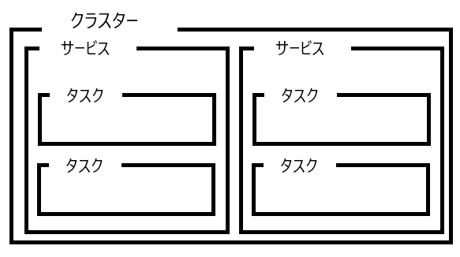

# ECSの構成要素

## ECSの構成要素概要
クラスター，タスク，タスク定義，サービスの4つから構成
- クラスター
    - コンテナを配置するEC2やFargateなど
    - サービスとタスクを実行する基盤
    - クラスタ名の作成，どのvpcにクラスタを作成するのか？を選択
- タスク
    - ECSの最小単位
    - アプリケーションの実行単位
    - 1つ以上のコンテナから構成
- タスク定義
    - 上のタスクをどのように生成するか，のテンプレート
    - アプリケーションを構成する1つ以上のコンテナを定義
    - JSONで記述
- サービス
    - クラスタ内で実行するコンテナ群を管理
    - どのタスク定義を利用して，どのECSクラスタを使用するか？
    - どのくらいのタスク数が必要なのか？

それぞれのイメージ

## クラスター
### 作成
- インフラストラクチャでFargateかEC2が選択できる
    - EC2を選択した場合は細かい設定が可能
        - スポットインスタンスの選択も可能

## タスク
### 作成
ウィザードから作成 or JSONで作成

## タスク定義
以下の情報が含まれる
- コンテナイメージ名
- コンテナとホスト間のポートマッピング
- 必要CPU/RAM
- 環境変数
- ネットワーク情報
- IAMロール

## サービス
- 作成したクラスター内に入り，サービスタブからサービスの作成ができる
