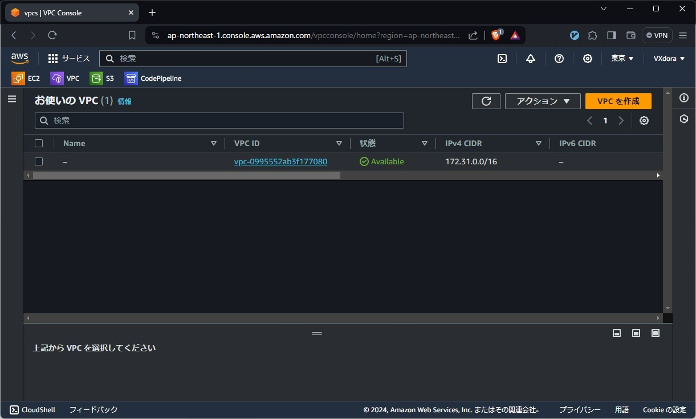
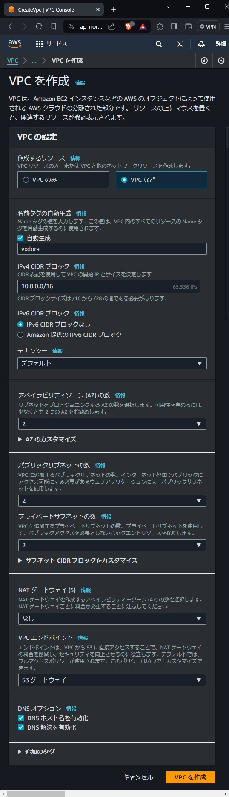

# ECSのCodePipelineデプロイ チュートリアル VPCの作成

## 概要
- ECSを動かすためのVPCを作成する
- 構成：
    - Public Subnet x2
        - ap-northeast-1a
        - ap-northeast-1c
    - Private Subnet x2
        - ap-northeast-1a
        - ap-northeast-1c

## VPCを作成
- VPCを検索し，VPCの画面を開く

画像の表示

- `VPCを作成`から，新しくVPCを作成する
    - 作成するリソース：`VPCなど`
    - 名前：`vxdora`
    - `DNSオプション`
        - `DNSホスト名を有効化`にチェック
        - `DNS解決を有効化`にチェック
    - その他はそのまま

画像の表示

