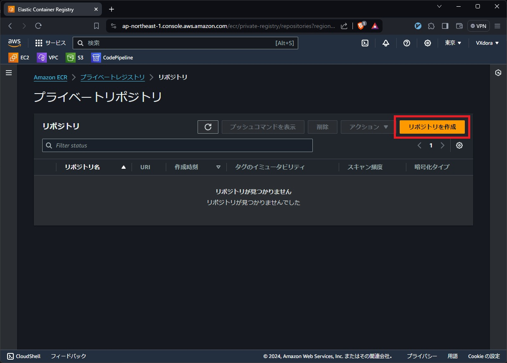
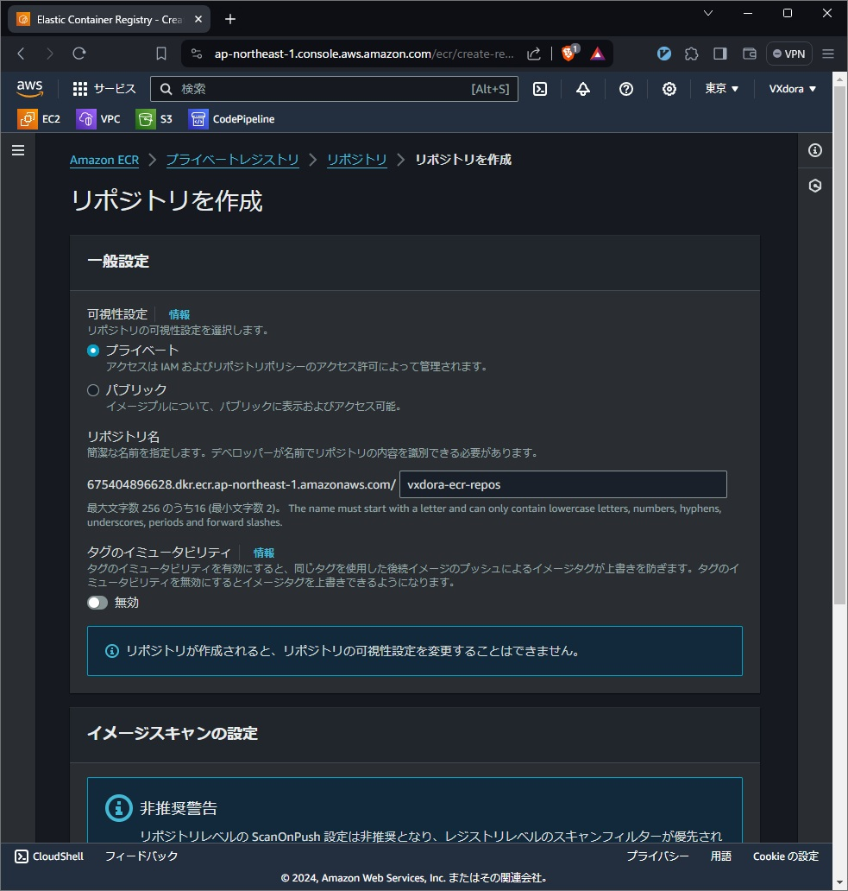

# ECSのCodePipelineデプロイ チュートリアル Elastic Container Registryの作成

## 目次

## 概要
- Docker Imageを保存しておくElastic Container Registryを作成

## Elastic Container Registryの作成
- `ECR` > `プライベートリポジトリ` から，`リポジトリを作成`をクリック

画像を表示

- 設定：
    - `可視性設定`：プライベート
    - `リポジトリ名`：`vxdora-ecr-repos`

画像を表示

## Links
Prev: [VPCの作成](./01.create_vpc.md)
